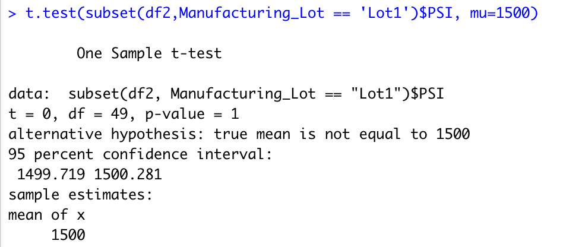

# MechaCar_Statistical_Analysis

## Linear Regression to predict MPG

Based on the linear regression we are able to see the ways in which different coefficients affect MPG. Vehiclal length and ground clearance have positive coefficients so arger vehicle length and more ground clearance correlate to more miles per gallon (with vehicle length having the most affect). All Wheel Drive has a negative relationship to MPG showing that not having AWD correlates to more MPG. And lastly spoiler angle and vehicle weight have positive coefficients but these coefficients are very small showing that they have little to no affect on MPG showing a more random amount of variance to the MPG values. This linear regression seems like an effective way to predict values for MPG of MechaCar Prototypes from all five of the independent variables discussed, especially with a small p-value validating the fact that the results are statistically significant.
## Summary Statistics on Suspension Coils

Given the design specifications for MechaCar suspension coils and the summary statistics above, on average the variance of the manufacturing data meets the requirement that states the variance should not exceed 100 pounds per square inch. However, when you look a bit closer at the summary statistics for each lot, you can see from the table above that Lot 3 does NOT meet this requirement with a variance of 170 pounds per square inch while the other lots do.

## T-Tests on Suspension Coils

The t-tests performed were done to determine if all manufacturing lots and each individually are statistically different from the population mean of 1500 pounds per square inch. The null hypothesis for the test states that there is no statistical difference between the dataset mean and the population mean of 1500. Based on the t-tests performed, we cannot reject the null hypothesis so there is no statistical difference between the mean for all manufacturing lots and the population mean. When doing t-tests on each lot individually, the only lot where the t-test had shown to be able to reject the null hypothesis was lot 3 with a p-value of approximately 0.042. This means that there is in fact a statistical difference between the mean for lot 3 and the population mean.

## Study Design: MechaCar vs Competition
An example of a statistical study that can quantify how the MechaCar performs against the competition as it relates to cost, fuel efficiency, horse power, maintenance cost, and safety rating could be conducting linear regressions on each of these elements (where each element is the dependent variable and other factors that could impact each are independent variables) for both MechaCar and its competitors then comparing the coefficients. Conducting the same linear regressions for MechaCar and its competitors allows us to directly measure the impact of different factors on each of the elements mentioned. Some examples would be the effects of vehicle size on fuel efficiency and effects of time of manufacturing on cost in their own respective regressions. We could also compare the averages of each of these elements between MechaCar and competitors through a null hypothesis and t-test. The null hypothesis would be that there is no statistical difference between average cost, fuel efficiency, horse power, etc. The alternative hypothesis would be that the true averages of each are not equal between MechaCar and its competitors. Then the t-test can either accept or reject the hypothesis. This would be a good test to do to compare the distribution of MechaCar for each of these factors versus competitors. We would obviously need averages for each of these factors for this test and additional numerical continuous information on any independent variables that can affect these factors for the linear regressions.
